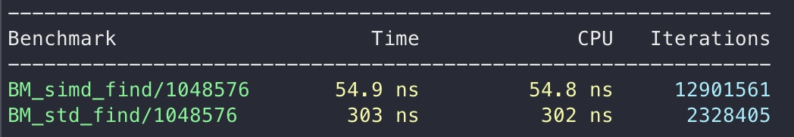

# Optimized `find` algorithm

In this code I attempted to implement a faster version of `std::find` using SWAR (SIMD Within a Register) operations. I also compared my implementation with `std::find` in the standard library using Google Benchmark to measure the performance

## Algorithm Explanation

`simd_find` function processes 8 integers at a time instead of one at a time (what `std::find` does). Here are a summary of the steps:
- Load 8 integers from the array into the AVX2 register using the `_mm256_loadu_si256`
- Compare those 8 values with a register containing 8 copies of the target we are trying to find using `_mm256_cmpeq_epi32`
- The result of this operation is stored in a bit map and we can extract the most significant bit of each comparison result using `mm256_movemask_epi8`.
- If any of the bits in the resulting integer is set, it means that a match has been found and we can return the index

## Usage

- Clone the repo
- Run using CMake
```sh
cmake -B build
cd build
make
./g_bench
```

## Result

For this benchmark I used MacBook Pro 2019, 2.3 GHz 8-Core Intel Core i9.

The `simd_find` function performed ~x6 better than `std::find` for an array containing ~1,000,000 random numbers with the target number being located exactly in the middle. The benchmark result is in the screenshot below:


