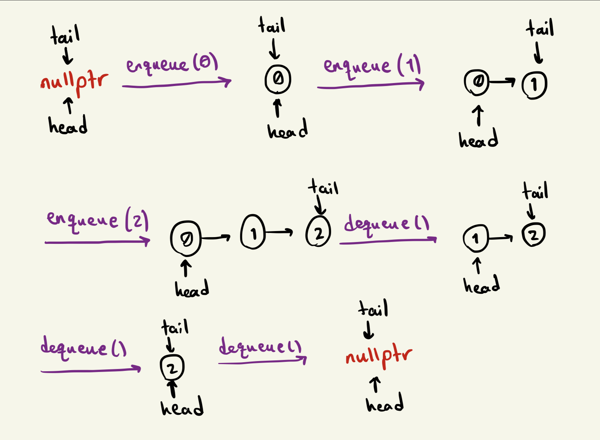
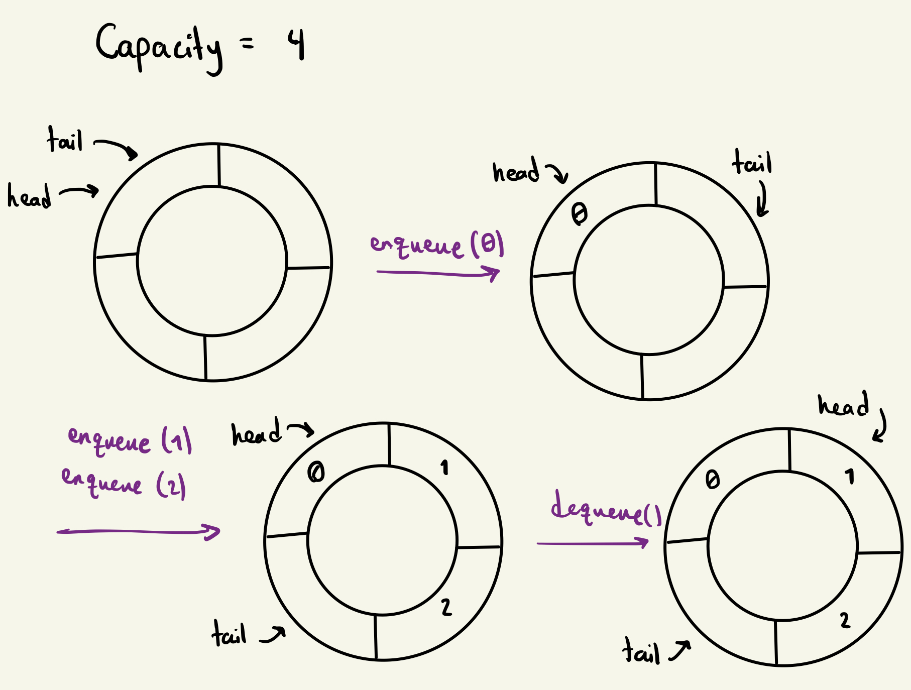

# Queue Data Structure
A queue is a linear data structure that follows the "first-in, first-out" (FIFO) principle. It very much resembles a normal queue in real life. The first person who gets in the queue (first-in) is the first person who gets out of it (first-out).
A queue supports two primary operations:
* `enqueue`: Adds an element to the back of the queue
* `dequeue`: Removes the element at the front of the queue

The three other basic operations of a queue are:
* `front` or `peek`: Returns the value of the element at the front of the queue without removing it
* `size`: Returns the number of elements currently in the queue
* `empty`: Returns true if the queue is empty (size == 0)

Some common applications of the Queue data structure:
* **Task Scheduling**: Queues can be used to schedule tasks based on the order they were received.
* **Breadth First Search**: Queues are used in the BFS algorithm to traverse graphs.
* **Message Buffering**: Processes and threads can use message queues to comminucate between each other.
* **Printer Queues**: Printing jobs are processed in the order they are received and they are added to a queue.

and many more. In general, whenever we want to process incoming data in the order they are received rather than immediately, using a queue is probably a good choice.

# Implementation
There are two main ways to implement a queue data structure; using a Linked List, or using an Array (circular buffer).

## Using a Linked List
Using a Linked List, we only need to store the `head` and the `tail` of the list. When we add an element, we create a new `tail` and have the previous `tail` point to it. When we remove an element, we assign the second element of the list to `head` and delete the first element. Here is a simple sketch of this process:



### Advantages
* There is no limit on the number of elements we can store in this type of queue. As long as we don't run out of memory, `enqueue` and `dequeue` operations are both going to be `O(1)` time complexity every time.
* There is no wasted memory space as memory is only allocated when needed, and the unused memory is deleted immediately.

### Disadvantages
* Since each node in the linked list needs to store a pointer to its next node, we are storing 4 or 8 extra bytes per element in the queue. The memory overhead can become quite significant if the queue contains a large number of elements.
* The nodes in the linked list are not adjacent in memory so they can't benefit from the caching capabilities of the system if there are multiple subsequent `enqueue` and `dequeue` operations.
* For every `enqueue` call we need to allocate memory in heap and for every `dequeue` call we need to release memory in heap. These are both expensive operations and can increase the latency in the program.

A very rudimentary implementation of this approach in C++ is as follows:
```cpp
// Nodes in the linked list
template <class T>
struct Node {
    T value;
    Node* next;
    Node(T val) : value(val), next(nullptr) {}
};

template <class T>
class Queue {
private:
    Node<T>* head_ = nullptr;
    Node<T>* tail_ = nullptr;
    size_t size_ = 0;
public:
    void enqueue(T value) {
        Node<T>* tmp = new Node<T>(value);
        // if the queue only has one element, head and tail point to the same node
        if (tail_ == nullptr) {
            head_ = tmp;
            tail_ = tmp;
            return;
        }

        tail_->next = tmp;
        tail_ = tmp;
        size_++;
    }

    void dequeue() {
        // Do nothing if the queue is empty
        if (head_ == nullptr)
            return;

        Node<T>* tmp = head_;
        head_ = head_->next;

        if (head_ == nullptr)
            tail_ = nullptr;

        delete tmp;
        size_--;
    }

    T front() const {
        if (head_ == nullptr)
            throw std::logic_error("Queue is empty");

        return head_->value; 
    }

    size_t size() const { return size_; }
    bool empty() const { return size_ == 0; }

    ~Queue() {
        // Deallocate all the memory to prevent memory leaks
        while (head_ != nullptr) dequeue();
    }
};
```

## Using an Array (Circular Buffer)
In this approach, we treat the array as a circular buffer. We store two indices of this array, `head` and `tail`, that point to the front and the back of the queue respectively. Whenever we add an element, we increment `tail` by one and whenever we remove an element, we increment `head` by one. If any of these indices go past the length of the array, they wrap around to the beginning.



### Advantages
* Since we are pre-allocating the memory, we can know ahead of time how much memory our queue is going to use.
* Because the elements in the queue are stored in adjacent memory locations, this approach is very cache friendly and can decrease latency in subsequent `enqueue` and `dequeue` calls.
* There is no new memory allocation after the construction of the queue which means that `enqueue` and `dequeue` are very cheap operations.

### Disadvantages
* The pre-allocation makes our queue fixed sized. There are three ways to handle a full queue in this approach, none of which is ideal:
    1. throw an exception
    2. resize the array and copy all the elements over to the new array. This is going to be an `O(n)` operation.
    3. start overwriting the elements in the front of the queue.
* If we allocate more memory than is needed, there might be unused space in the array which leads to wasted memory.

Sample implementation in C++:
```cpp
template <class T>
class Queue {
private:
    size_t head_ = 0, tail_ = 0;
    T* buffer_;
    size_t size_ = 0;
    size_t capacity_;
public:
    Queue(size_t size) : capacity_(size) {
        buffer_ = new T[size];
    }
 
    void enqueue(int value) {
        // If the queue is full, it overwrites the values
        buffer_[tail_] = value;
        tail_ = (tail_+1) % capacity_;
        size_++;
        if (size_ > capacity_) size_ = capacity_;
    }

    void dequeue() {
        // Do nothing if the queue is empty
        if (size_ == 0) return;
        head_ = (head_+1) % capacity_;
        size_--;
    }

    T front() const {
        if (size_ == 0) 
            throw std::logic_error("Queue is empty");

        return buffer_[head_];
    }

    size_t size() const { return size_; }
    bool empty() const { return size_ == 0; }

    ~Queue() {
        delete[] buffer_;
    }
};
```

## Benchmark
The difference in performance between these approaches is quite significant; much more than I initially expected. For the benchmark I enqueued 100 million elements to the queue in a for loop, and then dequeued all the elements in another for loop. The code for the benchmark can be found in [QueueLinkedList.cpp](./QueueLinkedList.cpp) and [QueueCircularBuffer.cpp](./QueueCircularBuffer.cpp).

* The Linked List implementation on average took `1.5144` seconds to enqueue and dequeue 100 million elements.
* The Array implementation on average took `0.6983` seconds to enqueue and dequeue 100 million elements.

Now, of course, the performance difference between these two implementations could be machine dependent and cannot be generalized to every situation. Furthermore, I didn't implement a resizeable circular buffer which would introduce a great amount of latency every time the array needs to be expanded. Additionally, my benchmark doesn't reflect the real world use cases of a queue, where multiple threades could be reading from and writing to a queue at the same time.

Overall, if we have an upper limit on the number of elements that can be in the queue ahead of time and having low latency is a priority, using an array to implement the Queue data structure seems to be the better choice.

# Thread Safety
Coming soon...
